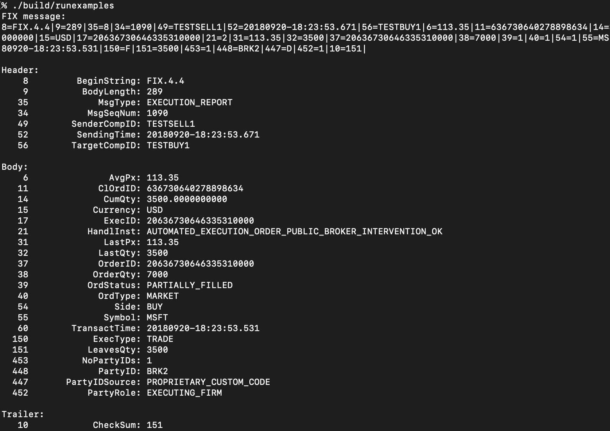

FIX 4.4 message parser
===

Financial Information eXchange (FIX) is the de-facto messaging standard for pre-trade, trade, and post-trade communication, as well as for U.S. regulatory reporting. It is used to disseminate price and trade information among investment banks and broker-dealers.

this library parses FIX messages and displays them in a human-readable way.

it also has checksum validation.

XML of spec is in `spec`. FIX message samples are in `samples`. example usage is in `examples`.

building
---

tested on ubuntu 22.04

deps:
- clang 16
- [pugixml](https://github.com/zeux/pugixml). install however, I installed `libpugixml-dev` with apt.
- [abseil](https://abseil.io/about/). not installed with apt since thats ~2yrs out of date

build with `scripts/build.sh`.

resources
---

- https://www.fixtrading.org/standards/fix-4-4/
- https://www.nyse.com/publicdocs/nyse/markets/nyse/NYSE_CCG_FIX_Sample_Messages.pdf
- https://bitnomial.com/docs/fix-common-messages/
- https://www.onixs.biz/fix-dictionary/4.4/fields_by_tag.html#
